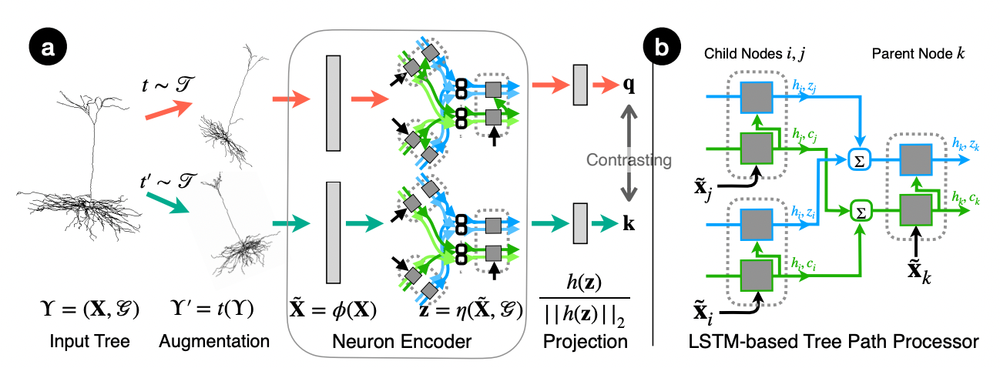

# [NeurIPS22] TreeMoCo: Contrastive Neuron Morphology Representation Learning

This repository holds the Pytorch implementation for TreeMoCo described in the paper
> [**TreeMoCo: Contrastive Neuron Morphology Representation Learning**](https://openreview.net/forum?id=p6hArCtwLAU),  
> Hanbo Chen*, Jiawei Yang*, Daniel Maxim Iascone, Lijuan Liu, Lei He, Hanchuan Peng, and Jianhua Yao
> advances in Neural Information Processing Systems (NeurIPS), 2022

<p align="center">
  
</p>

Abstract

    Morphology of neuron trees is a key indicator to delineate neuronal cell-types, analyze brain development process, 
    and evaluate pathological changes in neurological diseases. Traditional analysis mostly relies on heuristic features 
    and visual inspections. A quantitative, informative, and comprehensive representation of neuron morphology is largely 
    absent but desired. To fill this gap, in this work, we adopt a Tree-LSTM network to encode neuron morphology and 
    introduce a self-supervised learning framework named TreeMoCo to learn features without the need for labels. 
    We test TreeMoCo on 2403 high-quality 3D neuron reconstructions of mouse brains from three different public resources. 
    Our results show that TreeMoCo is effective in both classifying major brain cell-types and identifying sub-types. 
    To our best knowledge, TreeMoCo is the very first to explore learning the representation of neuron tree morphology with 
    contrastive learning. It has a great potential to shed new light on quantitative neuron morphology analysis. 

-------

This repository will hold the code for our neuron representation learning framework, named TreeMoCo.
We aim to bring advanced machine learning techniques for learning neuron morphology qualitatively and quantitatively.

[08/12/2023 update]
More details will be released in following weeks.

Stay tuned!

-----

# Installation

1. Create a conda environment:

```
conda create -n tree_moco python=3.7 -y
conda activate tree_moco
```

2. Install required python libraries with pip:

```
pip install -r requirements.txt
```

# Data Preparation

We use three datasets, i.e., the BIL dataset, the JML dataset and the ACT dataset. Some details are in [data/README.md](data/README.md).

# Training

(Tested) For TreeMoCo, run:

```
    python3 train_contrastive_all.py \
        --epochs 50 \
        --exp_name test \
        --bn \
        --projector_bn \
        --aug_scale_coords \
        --aug_jitter_coords \
        --aug_rotate \
        --aug_shift_coords \
        --aug_flip \
        --aug_mask_feats \
        --aug_jitter_length \
        --save_freq 50 \
        --knn \
        --eval_act \
        --eval_jm
```

I lost track of the `others` category, so I removed it from the pre-training dataset. This reduced the number of pre-training samples by 28%, which might lead to results slightly different from those in the paper. See `work_dir/test/train_20231016_122408.log` for the reproduced training log.

Comparison of frozen KNN accuracy:

Dataset | Original | Reproduced
--- | --- | ---
BIL | 78.91% | 76.45%
JML | 64.29% | 62.67%
ACT | 55.79% | 56.84%

# Useful tools

Since this project is to obtain a good discriminative embedding space, we need to visualize the neurons' representations properly. The followings are useful scripts for the use of interest.

- `cluster_analysis.py`: extract neurons' features from a pre-trained model and perform clustering.
- `visulize_cluster.py`: plot all neuron screenshots by tSNE coordinates to form an overview of the representation space. This script is mainly written by Hanbo.
- `generate_neuron_TU.py`: convert our neuron datasets to the TUDataset format. Most of graph contrastive learning works are based on the TUDataset format.
- `plot_trendlines.ipynb`: plot the KNN accuracy curves v.s. training epochs and the corresponding linear trendlines.
